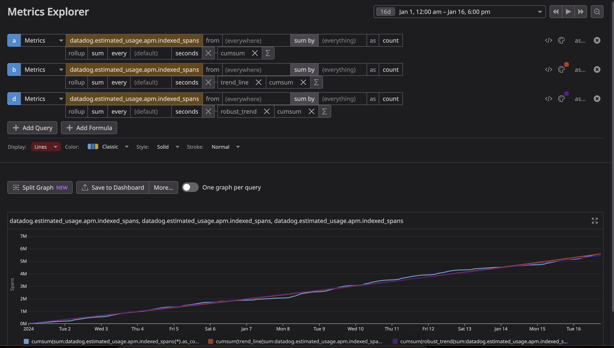

# Current Month Estimated Usage Metrics/Dashboard/Report

We often get questions on how customers can alert or create a dashboard on usage metrics compared to their committed spend.
In this case, we can graph out cumulative sum (MTD), which will add up all of the previous days in the month's usage. A good alert threshold would be 90% of the committed spend, so you have some time to adjust before you start getting charged for overages.
